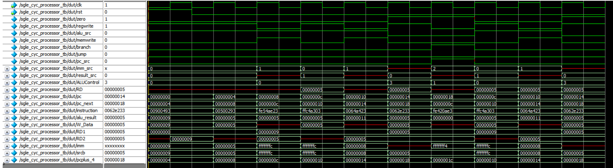

# single-cycle-riscv-processor

### The processor is verified using these instructions

```asm
      addi x9, x0, 9    #0x00900493
      addi x5, x0, 5    #0x00500293
      sw    x5, -4(x9)  #0xfe54ae23 
L1: lw x6, -4  (x9)     #0xffc4a303
       sw x6, 8  (x9)   #0x0064a423
       or  x4, x5, x6   #0x0062e233
       beq x4, x4, L1   #0xfe420ae3
```

## Testbench Results:


